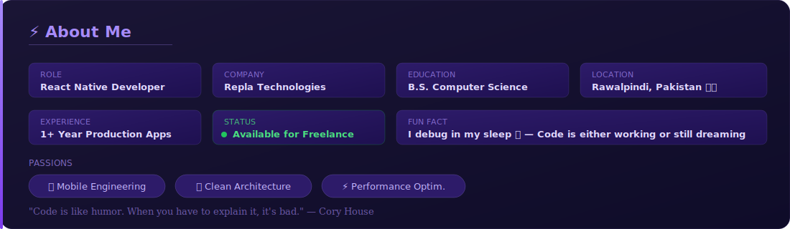
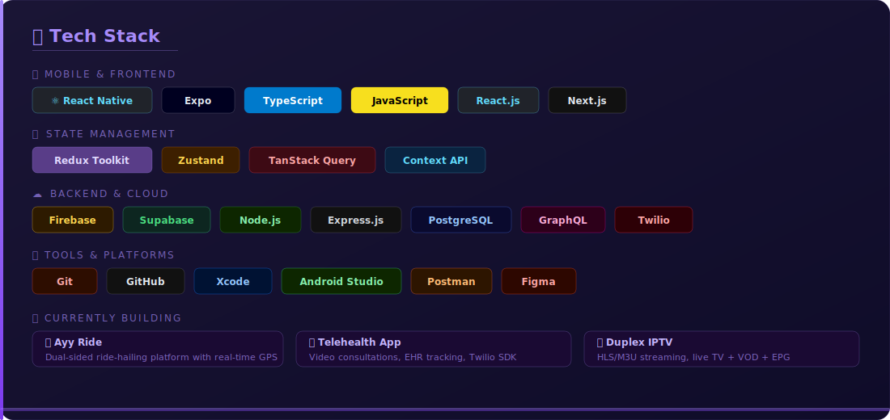

<div align="center">
<a href="https://github.com/SardarHussain65">
  
</a>
</div>

<div align="center">
<a href="https://git.io/typing-svg">
  
</a>
</div>

<br/>

<div align="center">

&nbsp;

&nbsp;

&nbsp;

</div>

<br/>

<div align="center">
<a href="https://github.com/SardarHussain65">
  
</a>
</div>

<br/>

<div align="center">
<a href="https://github.com/SardarHussain65">
  
</a>
</div>

<br/>

<div align="center">
<a href="https://github.com/SardarHussain65">
  
</a>
</div>

<br/>

<div align="center">
<a href="https://github.com/SardarHussain65">
  
</a>
</div>

<br/>

<div align="center">
<a href="https://github.com/SardarHussain65">
  
</a>
</div>

<br/>

## 🚀 Featured Projects

<div align="center">
<table>
<tr>
<td width="50%" valign="top">

### 🚗 Ayy Ride
**Dual-sided ride-hailing platform**

Driver & Passenger apps with real-time GPS tracking, dynamic fare calculation, and live trip updates.

`React Native` `Redux Toolkit` `Firebase` `Google Maps` `GraphQL`

🔐 *Production — Private*

</td>
<td width="50%" valign="top">

### 🏥 Telehealth App
**Healthcare consultation platform**

Video consultations, appointment scheduling & EHR tracking with secure patient data flow.

`React Native` `Redux Toolkit` `Twilio SDK` `REST APIs`

🔐 *Production — Private*

</td>
</tr>
<tr>
<td width="50%" valign="top">

### 📺 Duplex IPTV
**Cross-platform streaming app**

HLS/M3U playlists, live TV/VOD playback, EPG data, and smooth stream switching.

`React Native` `Expo` `expo-video` `TanStack Query`

🔐 *Production — Private*

</td>
<td width="50%" valign="top">

### 📦 QBox
**Enterprise property manager**

Role-based access control, service request system, and multi-tenant property management.

`React Native` `Zustand` `REST APIs`

🔐 *Production — Private*

</td>
</tr>
<tr>
<td width="50%" valign="top">

### 💬 Real-Time Chat
**Full-featured messaging app**

Media sharing, group chats, read receipts, and offline sync with Firestore.

`React Native` `Twilio Conversations` `Firestore`

🔐 *Production — Private*

</td>
<td width="50%" valign="top">

### 💍 Jewelry E-Commerce
**Mobile shopping experience**

Product catalog, cart system, and WhatsApp-based custom order flow.

`React Native` `Firebase` `Expo`

🔐 *Production — Private*

</td>
</tr>
</table>
</div>

<br/>

<div align="center">
<a href="https://github.com/SardarHussain65">
  
</a>
</div>

<br/>

## 📊 GitHub Stats

<div align="center">


</div>

<br/>

<div align="center">

</div>

<br/>

<div align="center">
<a href="https://github.com/SardarHussain65">
  
</a>
</div>

<br/>

## 📈 Contribution Activity

<div align="center">

</div>

<br/>

<div align="center">
<a href="https://github.com/SardarHussain65">
  
</a>
</div>

<br/>

## 🐍 Contribution Snake

<div align="center">
<picture>
  <source media="(prefers-color-scheme: dark)" srcset="https://raw.githubusercontent.com/SardarHussain65/SardarHussain65/output/github-contribution-grid-snake-dark.svg">
  <source media="(prefers-color-scheme: light)" srcset="https://raw.githubusercontent.com/SardarHussain65/SardarHussain65/output/github-contribution-grid-snake.svg">
  
</picture>
</div>

<br/>

<div align="center">
<a href="https://github.com/SardarHussain65">
  
</a>
</div>

<br/>

## 🎯 2026 Roadmap

```
✅ Ship 2 apps to App Store & Play Store
🔄 Master expo-video & advanced HLS streaming
🔄 Build an AI-powered feature with LangChain + FastAPI
🔄 Contribute to open-source React Native ecosystem
⏳ Complete B.S. Computer Science strong
⏳ Land a senior RN role or grow freelance client base
```

<br/>

<div align="center">
<a href="https://github.com/SardarHussain65">
  
</a>
</div>

<br/>

<div align="center">
<a href="https://github.com/SardarHussain65">
  
</a>

<a href="https://www.linkedin.com/in/sardar-hussain-25936337a">
  
</a>
&nbsp;
<a href="https://www.upwork.com/freelancers/~013ee56475f43c331c">
  
</a>
&nbsp;
<a href="mailto:sardar6hussain5@gmail.com">
  
</a>
&nbsp;
<a href="https://github.com/SardarHussain65">
  
</a>
</div>

<br/>

<div align="center">

</div>

<br/>

<div align="center">
<sub>💡 <i>"Code is like humor. When you have to explain it, it's bad."</i> — Cory House</sub>
</div>

<br/>

<div align="center">
<a href="https://github.com/SardarHussain65">
  
</a>
</div>
